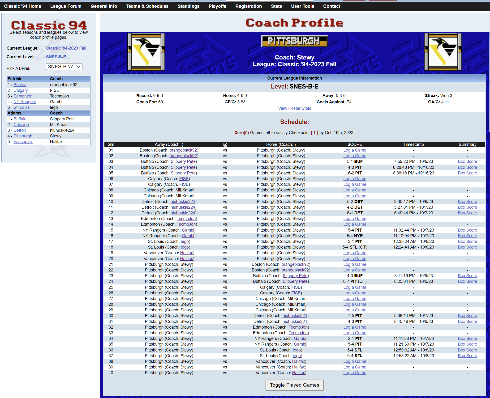
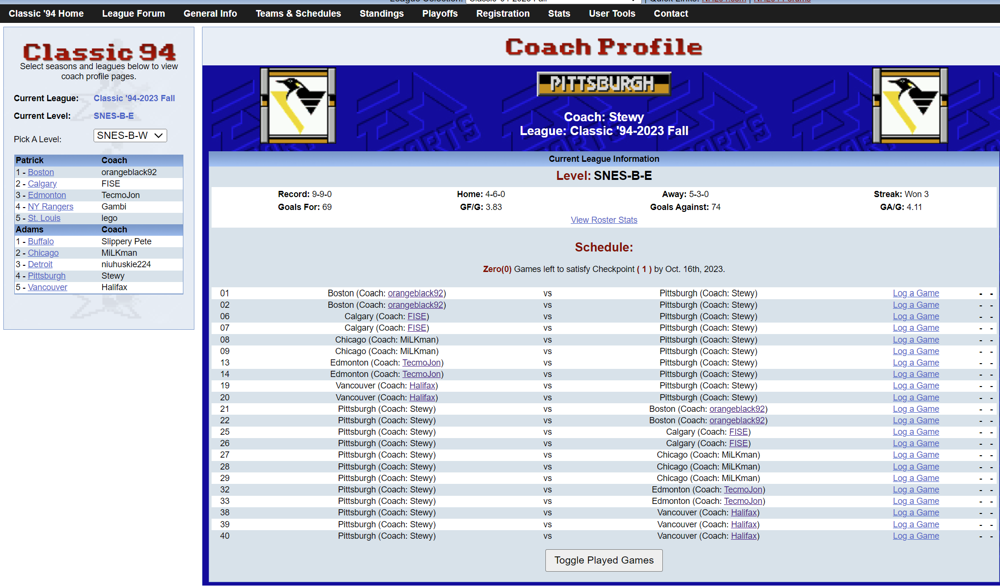

# NHL94 Online Adds Coaches' Names to Team Names User Script

This user script adds the coaches' names next to the team names on the NHL94 Online coach page. It retrieves specific tables using XPath and joins them based on the coaches' names. ** 

### How to install and use the script.
1. Install a user script manager extension for your browser such as [Tampermonkey](https://www.tampermonkey.net/)
1. Click on the Tampermonkey extension icon in your browsers extensions area of settings. 
1. Create a new script. It will have some boilerplate code in it. Just delete all of it. 
1. Copy the contents of the [jquery_append_coaches_name.user.js](jquery_append_coaches_name.user.js) file.
1. Paste it into the new script you just created.
1. Save the script.

### Usage

1. Navigate to the [NHL94 Online coach page](https://www.nhl94online.com/html/coachpage.php) and go to your coaches page for the league you want to see.
1. The script will automatically run when the page loads.
1. The team names in the games table will be updated to include the respective coaches' names.

### Images

## Before Toggle

## After Toggle

#### License

These user scripts are released under the [MIT License](LICENSE).
